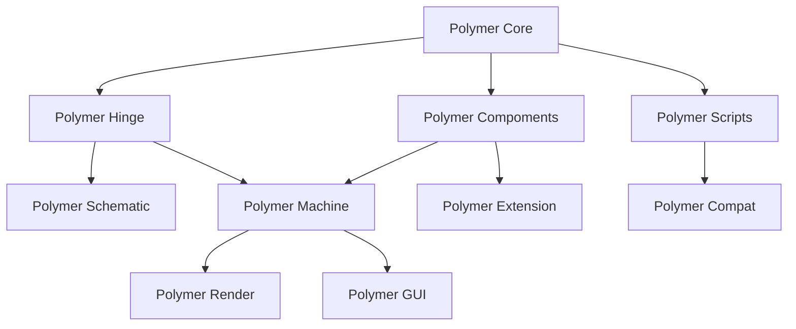

# Polymer 系列开发文档

### 模组结构

- Core
  - 通用Lib代码
  - 大部分公开API（包括子模块的，用接口包装+判断模组加载）
  - 大部分注册表
  - 子模块通信
- Hinge
  - 多方快结构主要代码
- Scripts
  - 脚本主要代码，提供通用的脚本API
  - Kotlin Script脚本支持
- Components
  - 机器组件定义
  - 多方快部件/机器方块生成
- Machine
  - 自定义机器逻辑
- Schematic
  - 机器蓝图
  - 机器多方快投影
- Render
  - 自定义机器渲染
  - 自定义机器粒子效果
  - 自定义机器模型
- GUI
  - 自定义GUI
  - 自定义JEI
- Extension
  - 其他模组组件/输入仓等兼容
- Compat
  - Crafttweaker脚本支持
  - Kubejs

